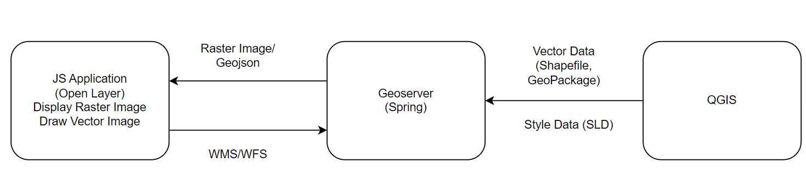
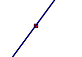

# Open Layer Example

## Project Structure

## Shapefile

A Shapefile is a geospatial vector data format. It consists three
mandatory file

- .shp: geometry data (the shapes of the features).

- .shx: shape index data (for indexing the geometry data).

- .dbf: attribute data in a tabular format (like a spreadsheet).

 

It can have other auxiliary files like:

- .prj: Contains the coordinate system and projection information.

- .sbn and .sbx: Spatial index files.

- .cpg: Specifies the character encoding for the .dbf file

 

## Styled Layer Descriptor (SLD)

### Example

    <?xml version="1.0" encoding="UTF-8"?>
    <StyledLayerDescriptor version="1.0.0"
        xsi:schemaLocation="http://www.opengis.net/sld StyledLayerDescriptor.xsd"
        xmlns="http://www.opengis.net/sld"
        xmlns:ogc="http://www.opengis.net/ogc"
        xmlns:xsi="http://www.w3.org/2001/XMLSchema-instance">
        <NamedLayer>
            <Name>point-style</Name>
            <UserStyle>
                <Title>Point Style</Title>
                <FeatureTypeStyle>
                    <Rule>
                        <PointSymbolizer>
                            <Graphic>
                                <Mark>
                                    <WellKnownName>circle</WellKnownName>
                                    <Fill>
                                        <CssParameter name="fill">#FF0000</CssParameter>
                                    </Fill>
                                    <Stroke>
                                        <CssParameter name="stroke">#000000</CssParameter>
                                        <CssParameter name="stroke-width">1</CssParameter>
                                    </Stroke>
                                </Mark>
                                <Size>6</Size>
                            </Graphic>
                        </PointSymbolizer>
                    </Rule>
                </FeatureTypeStyle>
            </UserStyle>
        </NamedLayer>
    </StyledLayerDescriptor>

 

### \<WellKnownName\>

The \<WellKnownName\> element within a \<Mark\> element specifies the
shape of a point symbol. This is used when styling point features and
allows you to use predefined geometric shapes to represent points on a
map.

 

The most commonly used well-known names are:

- circle

- square

- triangle

- star

- cross

- x

 

 

## Comparison of GeoJSON, WKT, KML and SLD

| **Feature** | **GeoJSON (Geographical JSON)** | **WKT (Well-Known Text)** | **KML (Keyhole Markup Language)** | **SLD (Styled Layer Descriptor)** |
|----|----|----|----|----|
| **Format** | JSON | Text | XML | XML |
| **Data** | Geodata & Basic Styles | Geodata only | Geodata & Styles | Geodata & Advanced Styles |
| **Styling** | Basic (via properties) | None | Extensive (colors, icons) | Advanced (color, width, rules) |
| **Complexity** | Lightweight, web-focused | Minimal, geometry only | Supports metadata and 3D models | Detailed styling, metadata |
| **Use Case** | Web apps, APIs | Simple geometry data | Rich visualizations (Google Earth) | Complex map styling (OGC services) |

 

### KML

    <Placemark>
      <name>Triangle</name>
      
      <Polygon>
        <outerBoundaryIs>
          <LinearRing>
            <coordinates>
              30.0,10.0,0 
              40.0,40.0,0 
              20.0,40.0,0 
              30.0,10.0,0
            </coordinates>
          </LinearRing>
        </outerBoundaryIs>
      </Polygon>
    </Placemark>

 

### GeoJSON

    {
      "type": "Feature",
      "geometry": {
        "type": "Polygon",
        "coordinates": [
          [
            [30.0, 10.0],
            [40.0, 40.0],
            [20.0, 40.0],
            [30.0, 10.0]
          ]
        ]
      },
      "properties": {
        "name": "Triangle",
        "stroke": "#ff0000",         // Red border
        "stroke-width": 2,           // Line width
        "stroke-opacity": 1.0,       // Border opacity
        "fill": "#00ff00",           // Green fill
        "fill-opacity": 0.5          // Fill opacity
      }
    }

 

### WKT

    POLYGON((30.0 10.0, 40.0 40.0, 20.0 40.0, 30.0 10.0))

 

### SLD

    <StyledLayerDescriptor version="1.0.0">
      <NamedLayer>
        <Name>Triangle Layer</Name>
        <UserStyle>
          <Title>Styled Triangle</Title>
          <FeatureTypeStyle>
            <Rule>
              <Name>Triangle Style</Name>
              <PolygonSymbolizer>
                <Fill>
                  <CssParameter name="fill">#00ff00</CssParameter> <!-- Green fill -->
                  <CssParameter name="fill-opacity">0.5</CssParameter> <!-- 50% opacity -->
                </Fill>
                <Stroke>
                  <CssParameter name="stroke">#ff0000</CssParameter> <!-- Red border -->
                  <CssParameter name="stroke-width">2</CssParameter> <!-- Line width -->
                </Stroke>
              </PolygonSymbolizer>
            </Rule>
          </FeatureTypeStyle>
        </UserStyle>
      </NamedLayer>
    </StyledLayerDescriptor>

 

 

## WMS, WFS and WCS

| **Feature** | **WMS (Web Map Service)** | **WFS (Web Feature Service)** | **WCS (Web Coverage Service)** |
|----|----|----|----|
| **Data Type** | Raster (map images) | Vector (geometries and attributes) | Raster (gridded data) |
| **Output** | Images (e.g., PNG, JPEG) | GML (Geography Markup Language) | GeoTIFF, NetCDF, HDF, etc. |
| **Query Capabilities** | Query based on map view, but limited to image output | Query based on feature properties, spatial queries, and more detailed attributes | Query based on grid and spatial extent, allowing for complex raster queries |
| **Usage Example** | Displaying a map layer on a web application | Extracting feature data for analysis or display in GIS software | Accessing and analysing environmental data such as temperature or precipitation |

 
